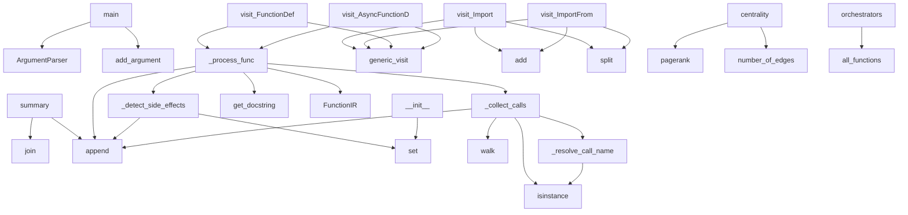

# System Architecture Analysis

## Overview

- **Project**: /home/tom/github/semcod/code2schema
- **Primary Language**: python
- **Languages**: python: 13, yaml: 9, json: 2, shell: 2, toml: 1
- **Analysis Mode**: static
- **Total Functions**: 103
- **Total Classes**: 12
- **Modules**: 28
- **Entry Points**: 72

## Architecture by Module

### project.map.toon
- **Functions**: 57
- **File**: `map.toon.yaml`

### code2schema.core.extractor
- **Functions**: 12
- **Classes**: 1
- **File**: `extractor.py`

### code2schema.analyzer.graph
- **Functions**: 8
- **File**: `graph.py`

### code2schema.analyzer.cqrs
- **Functions**: 7
- **File**: `cqrs.py`

### code2schema.codegen
- **Functions**: 7
- **File**: `__init__.py`

### code2schema.analyzer.events
- **Functions**: 4
- **Classes**: 3
- **File**: `events.py`

### code2schema.core.models
- **Functions**: 4
- **Classes**: 8
- **File**: `models.py`

### code2schema.codegen.visualizer
- **Functions**: 3
- **File**: `visualizer.py`

### code2schema.cli
- **Functions**: 2
- **File**: `cli.py`

## Key Entry Points

Main execution flows into the system:

### code2schema.cli.main
- **Calls**: argparse.ArgumentParser, parser.add_argument, parser.add_argument, parser.add_argument, parser.add_argument, parser.add_argument, parser.add_argument, parser.add_argument

### code2schema.analyzer.events.EventModel.summary
- **Calls**: None.join, lines.append, lines.append, lines.append, lines.append, len, len, len

### code2schema.core.extractor._FunctionVisitor._process_func
- **Calls**: self._collect_calls, self._detect_side_effects, ast.get_docstring, FunctionIR, self.functions.append, list, len, dict.fromkeys

### code2schema.core.extractor._FunctionVisitor._detect_side_effects
- **Calls**: set, effects.append, effects.append, effects.append, effects.append

### code2schema.core.extractor._FunctionVisitor._collect_calls
> Zbiera nazwy wszystkich wywołań funkcji wewnątrz węzła.
- **Calls**: ast.walk, isinstance, self._resolve_call_name, calls.append

### code2schema.core.extractor._FunctionVisitor.visit_Import
- **Calls**: self.generic_visit, self._imports.add, alias.name.split

### code2schema.core.extractor._FunctionVisitor.visit_ImportFrom
- **Calls**: self.generic_visit, self._imports.add, node.module.split

### code2schema.analyzer.cqrs.centrality
> PageRank — im wyższy, tym bardziej 'centralny' w architekturze.
- **Calls**: nx.pagerank, G.number_of_edges

### code2schema.core.extractor._FunctionVisitor.visit_FunctionDef
- **Calls**: self._process_func, self.generic_visit

### code2schema.core.extractor._FunctionVisitor.visit_AsyncFunctionDef
- **Calls**: self._process_func, self.generic_visit

### code2schema.core.extractor._FunctionVisitor._resolve_call_name
- **Calls**: isinstance, isinstance

### code2schema.core.extractor._FunctionVisitor.__init__
- **Calls**: set

### code2schema.core.models.SchemaIR.orchestrators
- **Calls**: self.all_functions

### code2schema.core.models.SchemaIR.commands
- **Calls**: self.all_functions

### code2schema.core.models.SchemaIR.queries
- **Calls**: self.all_functions

### code2schema.core.models.SchemaIR.all_functions

### project.map.toon._infer_role

### project.map.toon.build_call_graph

### project.map.toon.detect_cycles

### project.map.toon.centrality

### project.map.toon.build_workflows

### project.map.toon.generate_rules

### project.map.toon.analyze

### project.map.toon.infer_event_model

### project.map.toon._derive_event_name

### project.map.toon._past_tense

### project.map.toon.build_rich_graph

### project.map.toon.centrality_report

### project.map.toon.hub_nodes

### project.map.toon.layer_violations

## Process Flows

Key execution flows identified:

### Flow 1: main
```
main [code2schema.cli]
```

### Flow 2: summary
```
summary [code2schema.analyzer.events.EventModel]
```

### Flow 3: _process_func
```
_process_func [code2schema.core.extractor._FunctionVisitor]
```

### Flow 4: _detect_side_effects
```
_detect_side_effects [code2schema.core.extractor._FunctionVisitor]
```

### Flow 5: _collect_calls
```
_collect_calls [code2schema.core.extractor._FunctionVisitor]
```

### Flow 6: visit_Import
```
visit_Import [code2schema.core.extractor._FunctionVisitor]
```

### Flow 7: visit_ImportFrom
```
visit_ImportFrom [code2schema.core.extractor._FunctionVisitor]
```

### Flow 8: centrality
```
centrality [code2schema.analyzer.cqrs]
```

### Flow 9: visit_FunctionDef
```
visit_FunctionDef [code2schema.core.extractor._FunctionVisitor]
```

### Flow 10: visit_AsyncFunctionDef
```
visit_AsyncFunctionDef [code2schema.core.extractor._FunctionVisitor]
```

## Key Classes

### code2schema.core.extractor._FunctionVisitor
> Odwiedza węzły AST i buduje FunctionIR.
- **Methods**: 9
- **Key Methods**: code2schema.core.extractor._FunctionVisitor.__init__, code2schema.core.extractor._FunctionVisitor.visit_Import, code2schema.core.extractor._FunctionVisitor.visit_ImportFrom, code2schema.core.extractor._FunctionVisitor.visit_FunctionDef, code2schema.core.extractor._FunctionVisitor.visit_AsyncFunctionDef, code2schema.core.extractor._FunctionVisitor._process_func, code2schema.core.extractor._FunctionVisitor._collect_calls, code2schema.core.extractor._FunctionVisitor._resolve_call_name, code2schema.core.extractor._FunctionVisitor._detect_side_effects
- **Inherits**: ast.NodeVisitor

### code2schema.core.models.SchemaIR
> Korzeń modelu semantycznego całego projektu.
- **Methods**: 4
- **Key Methods**: code2schema.core.models.SchemaIR.all_functions, code2schema.core.models.SchemaIR.orchestrators, code2schema.core.models.SchemaIR.commands, code2schema.core.models.SchemaIR.queries
- **Inherits**: BaseModel

### code2schema.analyzer.events.EventModel
- **Methods**: 1
- **Key Methods**: code2schema.analyzer.events.EventModel.summary

### code2schema.core.models.FunctionIR
> Pojedyncza funkcja w modelu semantycznym.
- **Methods**: 1
- **Key Methods**: code2schema.core.models.FunctionIR.qualified_name
- **Inherits**: BaseModel

### code2schema.analyzer.events.DomainEvent
- **Methods**: 0

### code2schema.analyzer.events.CommandHandler
- **Methods**: 0

### code2schema.core.models.CQRSRole
- **Methods**: 0
- **Inherits**: str, Enum

### code2schema.core.models.SideEffect
- **Methods**: 0
- **Inherits**: str, Enum

### code2schema.core.models.ModuleIR
> Moduł (plik .py) z wyekstrahowanymi funkcjami.
- **Methods**: 0
- **Inherits**: BaseModel

### code2schema.core.models.WorkflowStep
- **Methods**: 0
- **Inherits**: BaseModel

### code2schema.core.models.WorkflowIR
> Graf wykonania (DAG) dla jednej funkcji-orkiestratora.
- **Methods**: 0
- **Inherits**: BaseModel

### code2schema.core.models.RuleIR
> Heurystyczna reguła jakości wygenerowana z analizy.
- **Methods**: 0
- **Inherits**: BaseModel

## Data Transformation Functions

Key functions that process and transform data:

### code2schema.core.extractor._FunctionVisitor._process_func
- **Output to**: self._collect_calls, self._detect_side_effects, ast.get_docstring, FunctionIR, self.functions.append

## Public API Surface

Functions exposed as public API (no underscore prefix):

- `code2schema.cli.main` - 70 calls
- `code2schema.analyzer.events.infer_event_model` - 21 calls
- `code2schema.analyzer.graph.graph_summary` - 21 calls
- `code2schema.codegen.to_markdown` - 16 calls
- `code2schema.core.extractor.extract_module` - 14 calls
- `code2schema.analyzer.events.EventModel.summary` - 11 calls
- `code2schema.analyzer.graph.write_dot` - 11 calls
- `code2schema.codegen.to_proto` - 10 calls
- `code2schema.analyzer.cqrs.analyze` - 9 calls
- `code2schema.analyzer.cqrs.generate_rules` - 6 calls
- `code2schema.analyzer.cqrs.build_call_graph` - 5 calls
- `code2schema.analyzer.graph.build_rich_graph` - 5 calls
- `code2schema.core.extractor.extract_project` - 5 calls
- `code2schema.analyzer.graph.centrality_report` - 4 calls
- `code2schema.analyzer.cqrs.build_workflows` - 3 calls
- `code2schema.core.extractor._FunctionVisitor.visit_Import` - 3 calls
- `code2schema.core.extractor._FunctionVisitor.visit_ImportFrom` - 3 calls
- `code2schema.codegen.visualizer.to_html` - 3 calls
- `code2schema.analyzer.cqrs.detect_cycles` - 2 calls
- `code2schema.analyzer.cqrs.centrality` - 2 calls
- `code2schema.analyzer.graph.detect_cycles` - 2 calls
- `code2schema.analyzer.graph.layer_violations` - 2 calls
- `code2schema.analyzer.graph.write_graphml` - 2 calls
- `code2schema.core.extractor._FunctionVisitor.visit_FunctionDef` - 2 calls
- `code2schema.core.extractor._FunctionVisitor.visit_AsyncFunctionDef` - 2 calls
- `code2schema.codegen.to_json` - 2 calls
- `code2schema.codegen.write_json` - 2 calls
- `code2schema.codegen.write_proto` - 2 calls
- `code2schema.codegen.write_markdown` - 2 calls
- `code2schema.codegen.visualizer.write_html` - 2 calls
- `code2schema.analyzer.graph.hub_nodes` - 1 calls
- `code2schema.core.models.SchemaIR.orchestrators` - 1 calls
- `code2schema.core.models.SchemaIR.commands` - 1 calls
- `code2schema.core.models.SchemaIR.queries` - 1 calls
- `code2schema.core.models.SchemaIR.all_functions` - 0 calls
- `project.map.toon.build_call_graph` - 0 calls
- `project.map.toon.detect_cycles` - 0 calls
- `project.map.toon.centrality` - 0 calls
- `project.map.toon.build_workflows` - 0 calls
- `project.map.toon.generate_rules` - 0 calls

## System Interactions

How components interact:



## Reverse Engineering Guidelines

1. **Entry Points**: Start analysis from the entry points listed above
2. **Core Logic**: Focus on classes with many methods
3. **Data Flow**: Follow data transformation functions
4. **Process Flows**: Use the flow diagrams for execution paths
5. **API Surface**: Public API functions reveal the interface

## Context for LLM

Maintain the identified architectural patterns and public API surface when suggesting changes.